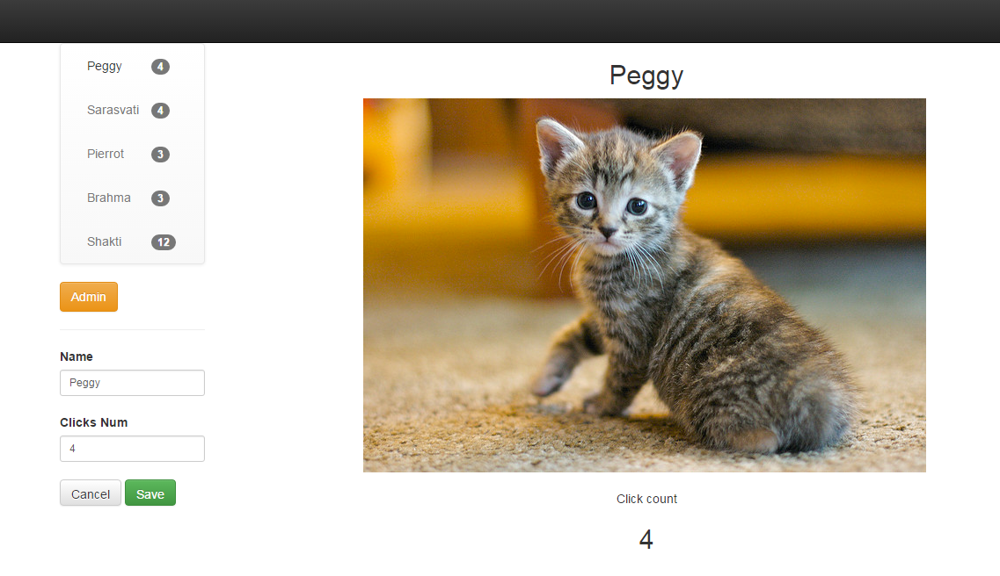

# Cat Clicker KnockoutJS

My version of class project [https://www.udacity.com/course/javascript-design-patterns--ud989].
A simple one-page KnockoutJS Model-View-ViewModel app.

In this version I refactored the Cat Clicker app (check my Cat Clicker repo) with Knockout (KO) JS library.
Thanks to KO library I had to write much less javascript code to achieve same functionalities, code is much more readable and mantainable.

Clone the repo and open up `index.html` in your browser of choice to start cat-clicking.

